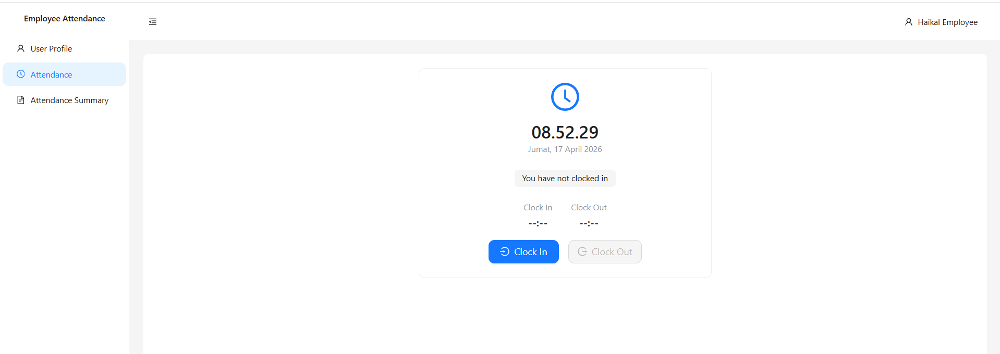

# Employee Attendance

<p align="center">
  
</p>

Fullstack web application for employee WFH attendance management built with **NestJS** (backend) and **React** (frontend).

## Key Features

- **Role-Based Access Control:** Separate application features for employees and admins with protected routes
- **Attendance Tracking:** Clock in/out with live clock, automatic status tracking, and duration calculation
- **Profile Management:** Employees can update their photo, phone number, and change password
- **Employee Management:** Admins can create, view, and edit employees with admin access toggle
- **Attendance Monitoring:** Admins can view all employees' attendance records with date range filtering
- **Real-Time Notifications:** WebSocket-powered live alerts to admins when employees update their profile data
- **Change Logging:** Profile changes are queued through RabbitMQ and persisted to a separate audit database
- **Responsive Design:** Adapted for all type of devices
- **Self-Protection:** Admins cannot accidentally revoke their own admin access
- **Auto-Seeding:** Demo accounts are automatically created on first run

## Technologies Used

- **NestJS:** Progressive Node.js framework with modular architecture
- **React (Vite):** Modern UI library with fast development server and optimized builds
- **TypeScript:** Static typing for safer and more maintainable code across frontend and backend
- **TypeORM:** Object-relational mapper for PostgreSQL with entity-based schema management
- **PostgreSQL:** Primary database for employees and attendance, plus a separate database for change logs
- **JWT & bcrypt:** JSON Web Token authentication with Passport strategy and secure password hashing
- **RabbitMQ (amqplib):** Message queue for asynchronous change log processing
- **Socket.IO:** WebSocket server and client for real-time admin notifications
- **Ant Design:** Enterprise-grade UI component library with built-in responsive grid
- **React Router:** Client-side routing with protected routes and nested layouts
- **Axios:** HTTP client with JWT interceptors for authenticated API calls
- **Day.js:** Lightweight date manipulation for filtering and formatting
- **Docker Compose:** Containerized PostgreSQL databases and RabbitMQ for one-command setup

## Prerequisites

- Node.js >= 18
- Docker & Docker Compose

## Getting Started

### 1. Start Infrastructure

```bash
docker compose up -d
```

This will start:
- PostgreSQL (main DB) on port `5432`
- PostgreSQL (logs DB) on port `5433`
- RabbitMQ on port `5672` (management UI: `http://localhost:15672`)

### 2. Start Backend

```bash
cd backend
npm install
npm run start:dev
```

Backend will run on `http://localhost:3000`. On first run, it automatically seeds demo data.

### 3. Start Frontend

```bash
cd frontend
npm install
npm run dev
```

Frontend will run on `http://localhost:5173`.

## Demo Accounts

| Role     | Email                 | Password    |
|----------|-----------------------|-------------|
| Admin    | admin.hrd@gmail.com   | password123 |
| Employee | mhaikalb@gmail.com    | password123 |
| Employee | testingguy@gmail.com  | password123 |
| Admin    | randi.putra@gmail.com | password123 |

## Pages & Modules

### Employee Pages
- **Login:** JWT authentication with role-based redirect
- **Profile:** View info, upload photo, edit phone number, change password
- **Attendance:** Live clock with clock in/out buttons and daily status tracking
- **Attendance Summary:** History table with date range filter and duration calculation

### Admin Pages
- **Employee Management:** List, create, and edit employees with admin access toggle
- **Attendance Monitoring:** View all employees' attendance records with date filtering
- **Employee Features:** Admins also have access to all employee pages from the same panel

## API Endpoints

### Auth
- `POST /api/auth/login` - Login with email & password

### Employees (requires JWT)
- `GET /api/employees/me` - Get current user profile
- `PATCH /api/employees/me` - Update current user profile (phone, photo)
- `POST /api/employees/me/change-password` - Change current user password
- `GET /api/employees` - [Admin] List all employees
- `POST /api/employees` - [Admin] Create employee
- `PATCH /api/employees/:id` - [Admin] Update employee

### Attendance (requires JWT)
- `POST /api/attendances/clock-in` - Submit Clock in record
- `POST /api/attendances/clock-out` - Submit Clock out record
- `GET /api/attendances/me?from=&to=` - Get own attendance summary
- `GET /api/attendances?from=&to=` - [Admin] Get all attendance

## Architecture

```
┌──────────────┐     ┌──────────────┐
│    React     │────>│   NestJS     │
│  (Frontend)  │     │  (Backend)   │
└──────────────┘     └──┬───┬───┬──┘
                        │   │   │
               ┌────────┘   │   └────────┐
               │            │            │
      ┌────────▼───┐ ┌─────▼─────┐ ┌────▼────────┐
      │ PostgreSQL │ │ RabbitMQ  │ │ PostgreSQL  │
      │ (Main DB)  │ │ (Queue)   │ │ (Logs DB)   │
      └────────────┘ └───────────┘ └─────────────┘
```

## Project Structure

```
employee-attendance/
├── backend/
│   └── src/
│       ├── auth/           # JWT authentication
│       ├── employee/       # Employee CRUD & profile
│       ├── attendance/     # Clock in/out & summaries
│       ├── notification/   # WebSocket & RabbitMQ
│       ├── entities/       # TypeORM entities
│       ├── seed/           # Demo data seeder
│       └── config/         # Database configurations
├── frontend/
│   └── src/
│       ├── api/            # Axios instance & interceptors
│       ├── context/        # Auth context (React Context)
│       ├── components/     # Reusable components
│       ├── layouts/        # Employee & Admin layouts
│       └── pages/
│           ├── employee/   # Profile, Attendance, Summary
│           └── admin/      # Employee management, Monitoring
└── docker-compose.yml      # PostgreSQL, RabbitMQ
```
